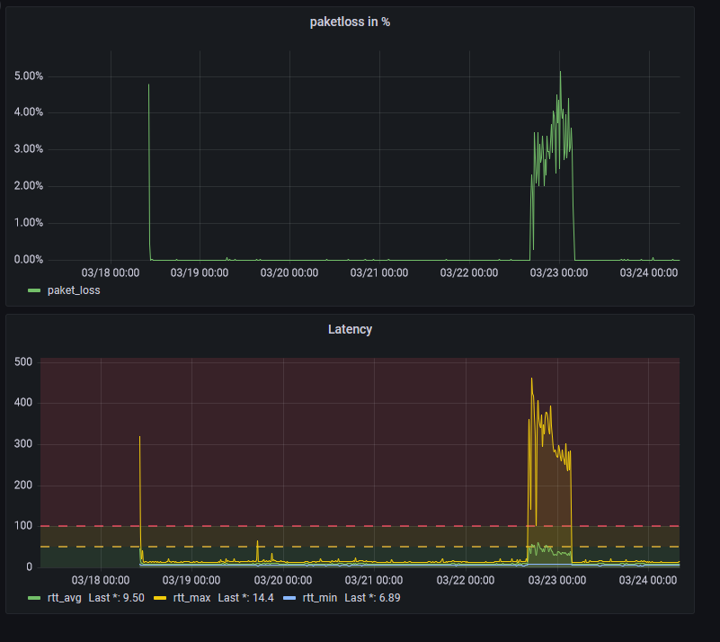

> **_NOTE:_**  Work in progress!
# Simple Paketloss Log
Simple tool to visualize `ping`s output.
This tool parses a simple `ping` std output and is able to create graphs using `matplotlib`.
It is also capable to push the results to a `influxdb` instance, which can be used to visualize the data using `grafana`. See the `watch` command.



# Install:
This project uses `PyPoetry` as dependency management and structure.
- Install `pypoetry`
- Run `poetry install`
- Within that poetry env one can use the `simple-paketloss-log` cli.

# How to:
## 1. Setup a periodic `ping` run using `cron`:
- I use `pingcheck.sh` to trigger a such call with some parameters.
- The result gets append to a `ping.log` file.
- After every run, a `delimiter` line is added.
- To prevent from concurrent running, if one takes longer than 30s, i introduce a locking mechanism.

`crontab` setup: I start a ping run each 30s.
```
$ crontab -e
* * * * *  <PathToScript>/pingcheck.sh
* * * * * ( sleep 30 ; <PathToScript>/pingcheck.sh )
```
## 2. Wait until some runs logged in to the `ping.log`.
## 3. Run the `simple-paketloss-log` cli
There are several commands available:
### **Read** measurements:
Read measurements from file ping.log
```
$ simple-paketloss-log read ping.log
```
Output:
```
Found 3098 measurements
Maximal paket loss: 0.09
Average rtt: 9.81804519044544 ms
--------------------
``` 
### Create a **graph** with Matplotlib:
I currently don't use this at all. I use `influxdb` and `grafana` instead.
```
$ simple-paketloss-log graph ping.log 
```
Output:


### Watch a log file
```
$ simple-paketloss-log watch ping.log 
```
Make sure to have a `influxdb` instance running and provide the needed host, org, bucket and token. See `--help`.

### **Read and then watch** a log file
This will read the log file, send its content to the `influxdb` instance and then watch the file for new content.
```
$ simple-paketloss-log read-and-watch ping.log
```
Make sure to have a `influxdb` instance running and provide the needed host, org, bucket and token. See `--help`.

# Grafana dashboard example:
You can find the dashboard model [here](grafana_dashboard.json).


